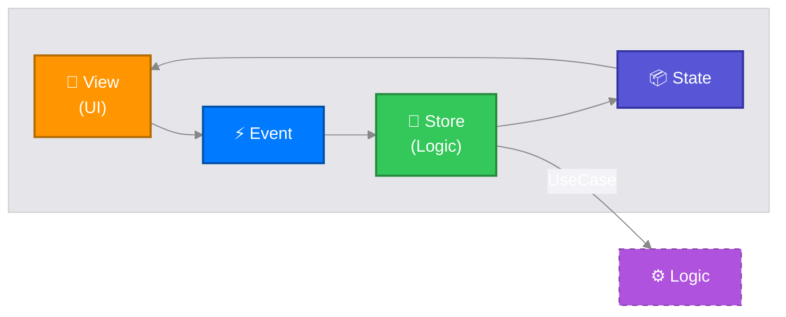
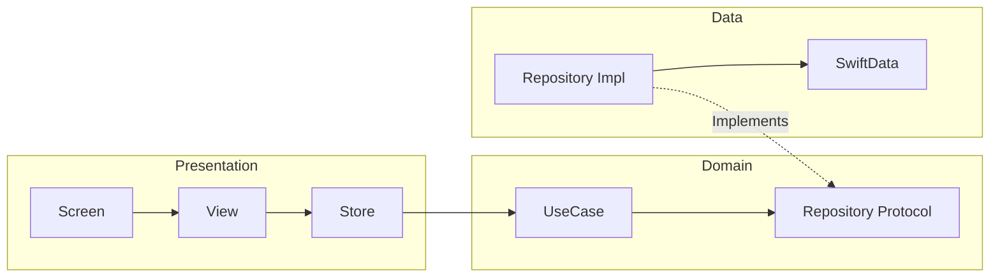

# MESA-iOS

**MESA-iOS — Trapezio is the iOS implementation of the MESA Framework (Modular, Explicit, State-driven, Architecture)**

Trapezio is a production-grade architectural library for SwiftUI, designed to enforce unidirectional data flow (UDF), strictly typed navigation, and a clean separation of concerns.

## 🏛 MESA Architecture Pillars

1.  **Modular**: Encourages feature-based partitioning. Features are isolated and portable.
2.  **Explicit**: Clear, type-safe boundaries between Routing (**Screen**), Logic (**Store**), and Rendering (**UI**).
3.  **State-driven**: The UI is a pure projection of the State. Unidirectional Data Flow is strictly enforced.
4.  **Architecture**: Provides the structural "Trapeze" to safely swing between Business Logic and UI.

### Data Flow



---

## 📚 Libraries

| Module | Purpose | Key Components |
|:---|:---|:---|
| **Trapezio** | Core MVI/UDF primitives | `TrapezioStore`, `TrapezioState`, `TrapezioScreen`, `TrapezioUI`, `TrapezioContainer`, `TrapezioInterop`, `TrapezioMessage` |
| **TrapezioNavigation** | Type-safe Navigation | `TrapezioNavigator`, `TrapezioNavigationHost` |
| **Strata** | Clean Architecture & Logic | `StrataInteractor`, `StrataSubjectInteractor`, `StrataResult`, `StrataException`, `StrataExecutionException`, `StrataTimeoutException`, `strataLaunch`, `strataLaunchInterop`, `strataLaunchMain`, `strataLaunchWithResult`, `strataCollect`, `strataRunCatching` |
| **TrapezioTest** | Test Utilities | `FakeTrapezioNavigator`, `TestEventSink`, `NavigationEvent`, `TrapezioStore.test()`, `TrapezioStore.awaitState()` |

---

## 📱 Platform Requirements

| Platform | Minimum |
|:---|:---|
| iOS | 17.0 |
| macOS | 14.0 |

Trapezio uses the `@Observable` macro, so SwiftUI tracks state reads at **property granularity** — a view reading only `state.count` is not invalidated when an unrelated field changes. This is why the floor is iOS 17; `ObservableObject` invalidated on every published change regardless of what a view actually read.

> **Upgrading from 0.2.x?** The minimum deployment target moved from iOS 16 / macOS 13. See [Migrating to 0.3.0](#-migrating-to-030).

---

## 📦 Installation

### Swift Package Manager

Add MESA-iOS to your project via SPM:

```swift
dependencies: [
    .package(url: "https://github.com/jkjamies/MESA-iOS.git", from: "0.3.0")
]
```

Then add the libraries you need to your target:

```swift
.target(
    name: "YourApp",
    dependencies: [
        .product(name: "Trapezio", package: "MESA-iOS"),
        .product(name: "TrapezioNavigation", package: "MESA-iOS"),
        .product(name: "Strata", package: "MESA-iOS"),
        // For test targets only:
        // .product(name: "TrapezioTest", package: "MESA-iOS"),
    ]
)
```

### XCFramework

Pre-built XCFrameworks for each library are attached to every [GitHub Release](https://github.com/jkjamies/MESA-iOS/releases) from **v0.3.0** onward:

| Artifact | Contents |
|:---|:---|
| `Trapezio.xcframework.zip` | Core MVI/UDF primitives |
| `TrapezioNavigation.xcframework.zip` | Type-safe navigation |
| `Strata.xcframework.zip` | Clean Architecture use cases & concurrency helpers |

Download the `.xcframework.zip` for the libraries you need and add them to your Xcode project under **Frameworks, Libraries, and Embedded Content**.

---

## 🏗 Architectural Layers

Trapezio strictly enforces **Clean Architecture** combined with **MVI** for the presentation layer.

### 1. Presentation Layer (`:presentation`)
-   **Role**: Manages UI state and handles user interaction.
-   **Components**: `TrapezioStore`, `TrapezioUI`, `TrapezioScreen`, `TrapezioContainer`, `TrapezioRuntime`, `TrapezioMessage`/`TrapezioMessageManager`.
-   **Threading**: Strictly **Main Actor**.
-   **Dependencies**: Depends on **Domain**. NEVER depends on Data.

### 2. Domain Layer (`:domain`)
-   **Role**: Pure business logic.
-   **Components**:
    -   **Use Cases** (Open classes): `StrataInteractor<P, T>` (one-shot) and `StrataSubjectInteractor<P, T>` (stream-based).
    -   **Interfaces**: Repository protocols.
    -   **Models**: Pure data structures.
-   **Threading**: **Actor Agnostic**. Must be safe to call from any thread.
-   **Dependencies**: Depends on **Nothing** (except standard library).

### 3. Data Layer (`:data`)
-   **Role**: Data retrieval, persistence, and networking.
-   **Components**:
    -   **Repositories**: Implement Domain interfaces.
    -   **Data Sources**: Database (`SwiftData`), Network API.
-   **Threading**: Strictly **Background** (using `actor` / `ModelActor`).
-   **Dependencies**: Depends on **Domain**.

### Dependency Graph



---

## 🚀 Usage Guide

### 1. The Screen (Identity)
The `TrapezioScreen` is a `Hashable & Codable` struct acting as the route and configuration for a feature.
```swift
struct CounterScreen: TrapezioScreen {
    let initialValue: Int
}
```

### 2. The Store (Presentation Logic)
The `TrapezioStore` manages state. It injects **Use Cases** to perform work.
```swift
@MainActor
final class SummaryStore: TrapezioStore<SummaryScreen, SummaryState, SummaryEvent> {
    private let saveUseCase: SaveLastValueUseCase

    init(screen: SummaryScreen, saveUseCase: SaveLastValueUseCase) {
        self.saveUseCase = saveUseCase
        super.init(screen: screen, initialState: SummaryState(value: screen.value))
    }

    override func handle(event: SummaryEvent) {
        switch event {
        case .save:
            // Work runs detached (off main), reduce runs on @MainActor
            strataLaunch(
                work: { await self.saveUseCase.execute(params: self.state.value) },
                reduce: { result in
                    self.update {
                        $0.saveMessage = result.fold(
                            onSuccess: { _ in "Saved." },
                            onFailure: { error in "Failed: \(error.message)" }
                        )
                    }
                }
            )
        }
    }
}
```

### 3. The Use Case (Domain Logic)
Use Cases encapsulate specific business rules. Subclass `StrataInteractor<P, T>` (one-shot) or `StrataSubjectInteractor<P, T>` (stream).
```swift
final class SaveLastValueUseCase: StrataInteractor<Int, Void> {
    private let repository: SummaryRepository

    init(repository: SummaryRepository) {
        self.repository = repository
        super.init()
    }

    override func doWork(params: Int) async -> StrataResult<Void> {
        return await executeCatching(params: params) { val in
            try await repository.saveValue(val)
        }
    }
}
```

### 4. The UI (Stateless View)
The `TrapezioUI` is a pure mapping function `(State) -> View`. It calls `onEvent` to dispatch user intents.
```swift
struct CounterUI: TrapezioUI {
    func map(state: CounterState, onEvent: @escaping @MainActor (CounterEvent) -> Void) -> some View {
        VStack {
            Text("Count: \(state.count)")
            Button("Increment") { onEvent(.increment) }
        }
    }
}
```

### 5. The Factory (Composition Root)
`TrapezioContainer` preserves store identity across SwiftUI view updates. Factories assemble the dependency graph.
```swift
struct CounterFactory {
    @MainActor
    static func make(screen: CounterScreen, navigator: (any TrapezioNavigator)?, interop: (any TrapezioInterop)?) -> some View {
        TrapezioContainer(
            makeStore: CounterStore(screen: screen, divideUsecase: DivideUsecase(), navigator: navigator, interop: interop),
            ui: CounterUI()
        )
    }
}
```

> **`makeStore` is an `@autoclosure`.** Store construction is deferred and happens once — but only for what is written *inside* it. Dependencies built in the surrounding factory body run on every view evaluation and are then discarded, which is expensive for repositories, database contexts, and network clients:
>
> ```swift
> // Wrong — a new repository (and ModelContext) per render.
> let repo = SummaryRepositoryImpl(container: container)
> return TrapezioContainer(makeStore: SummaryStore(repo: repo), ui: SummaryUI())
>
> // Right — the whole graph is built once, inside the autoclosure.
> return TrapezioContainer(
>     makeStore: {
>         let repo = SummaryRepositoryImpl(container: container)
>         return SummaryStore(repo: repo)
>     }(),
>     ui: SummaryUI()
> )
> ```

### Key Protocols

| Protocol | Conforms To | Purpose |
|:---|:---|:---|
| `TrapezioScreen` | `Hashable`, `Codable` | Route identity and parameters |
| `TrapezioState` | `Equatable` | Immutable display data. `Equatable` enables `update()` to skip redundant publishes |
| `TrapezioEvent` | — | Marker protocol for user intents (no requirements) |
| `TrapezioUI` | — | Stateless `map(state:onEvent:) -> some View` |

### TrapezioStore Internals

- `@MainActor @Observable open class TrapezioStore<S, State, Event>`
- `state` is `public private(set)` and fully `@MainActor`-isolated. Detached work cannot read it directly — take a `Sendable` snapshot with `launch(snapshot:work:reduce:)` instead
- `update(_ transform:)` — copy-on-write mutation with an `Equatable` check. Assigning an equal value would still notify observers, so the check is what prevents redundant invalidation
- `@Observable` applies to `TrapezioStore` itself. A subclass's own stored properties are **not** tracked, which is deliberate: feature state belongs in `state`, not in subclass fields
- `tasks` — a `TrapezioTaskBag` scoping everything the store started; cancelled on deallocation
- `render(with: ui)` — binds the store to a `TrapezioUI` and returns a `TrapezioRuntime` view

#### Starting work from a store

Use the store's own methods rather than the free `strata*` functions. They track their task in `tasks`, so work started by a store is cancelled when the store goes away.

| Method | Work thread | Result thread |
|:---|:---|:---|
| `launch(work:reduce:)` | Detached | `@MainActor` via `reduce` |
| `launch(snapshot:work:reduce:)` | Snapshot on `@MainActor`, work detached | `@MainActor` via `reduce` |
| `launchMain(work:reduce:)` | `@MainActor` | `@MainActor` via `reduce` |
| `collect(_:action:)` | Detached | `@MainActor` per emission |
| `cancelAll()` | — | Cancels every tracked task |

```swift
// Reading state inside detached work is a data race. Snapshot it first.
launch(
    snapshot: { $0.count },
    work: { count in await divideUseCase.execute(value: count) },
    reduce: { [weak self] result in self?.update { $0.count = result } }
)
```

> A task that captures its store **strongly** keeps the store alive, so automatic cancellation never runs. Capture `[weak self]` in long-lived work.

### TrapezioLifecycle

Conform a store to `TrapezioLifecycle` and `TrapezioRuntime` drives it from the hosting view:

| Callback | Fires |
|:---|:---|
| `onFirstAppear()` | Once per view identity, before the first `onAppear()`. Start observation here |
| `onAppear()` | Every appearance, including when revealed by a pop. Consume navigation results here |
| `onDisappear()` | Every disappearance |

```swift
final class SummaryStore: TrapezioStore<...>, TrapezioLifecycle {
    func onFirstAppear() {
        collect(observeLastValue.stream) { [weak self] value in
            self?.update { $0.lastSaved = value }
        }
        observeLastValue(())
    }
}
```

### TrapezioMessage

`TrapezioMessageManager` provides transient user-facing messages (snackbars, alerts). Emit via `emit(_:)`, observe via `messagesSequence` (`AsyncStream<[TrapezioMessage]>`), clear via `clearMessage(id:)` or `clearAll()`. The queue is capped at 10 messages — oldest are dropped when over capacity.

`TrapezioMessage` can be created from a `String` or directly from an `Error` (uses `localizedDescription`).

---

## 🧵 Threading & Concurrency Model

Trapezio enforces a robust threading model to prevent UI jank and race conditions.

| Component | Thread / Actor | Rule |
|:---|:---|:---|
| **UI** | `@MainActor` | All rendering code must be on Main. |
| **Store** | `@MainActor` | State updates and `reduce` closures happen on Main. |
| **Use Case** | Actor-agnostic | Plain classes — they don't dictate threading. |
| **Repository** | `actor` | Database/Network I/O is forced to background. |

### Concurrency Primitives

Most primitives use `Task.detached` to guarantee work runs off the main thread. The exception is `strataLaunchMain(work:reduce:)`, which uses `Task` on the `@MainActor` for use cases requiring main-thread execution:

| Function | Work Thread | Result Thread | Cancellation | Returns |
|:---|:---|:---|:---|:---|
| `strataLaunch(work:reduce:)` | Detached (cooperative pool) | `@MainActor` via `reduce` | Skips `reduce` | `Task<Void, Never>` |
| `strataLaunchWithResult(operation:)` | Detached (cooperative pool) | Caller awaits `.value` | — | `Task<StrataResult<T>, Never>` |
| `strataLaunchInterop(work:reduce:catch:)` | Detached (cooperative pool) | `@MainActor` via `reduce`/`catch` | Routes `CancellationError()` to `catch` | `Task<Void, Never>` |
| `strataLaunchMain(work:reduce:)` | `@MainActor` | `@MainActor` via `reduce` | Skips `reduce` | `Task<Void, Never>` |
| `strataCollect(stream, action:)` | Detached (cooperative pool) | `@MainActor` via `action` per emission | — | `Task<Void, Never>` |
| `strataRunCatching { }` | Inherits caller context | Same | Returns `.failure(StrataCancellationException)` | `StrataResult<T>` |

All return `@discardableResult` — ignore for fire-and-forget, or store the `Task` handle for cancellation.

### StrataException

`StrataException` is the base error protocol (`LocalizedError & Sendable` + `message: String`) for all domain failures. It is the error type carried by `StrataResult.failure`. Implement it on simple structs to define domain-specific errors.

It refines `LocalizedError` rather than plain `Error` deliberately: Foundation supplies a `localizedDescription` on every `Error` and the choice is resolved statically, so a value typed as `any Error` would otherwise show "The operation couldn't be completed…" instead of `message`. Conforming to `LocalizedError` makes `message` authoritative everywhere, including `TrapezioMessage(_:)`.

### StrataResult Operations

| Method | Description |
|:---|:---|
| `.onSuccess { }` | Executes closure on success, returns self (chainable) |
| `.onFailure { }` | Executes closure on failure, returns self (chainable) |
| `.map { }` | Transforms success value, preserves failure |
| `.flatMap { }` | Chains dependent `StrataResult`-returning operations; short-circuits on failure |
| `.recover { }` | Attempts async recovery on failure, passes through on success |
| `.fold(onSuccess:onFailure:)` | Exhaustive match returning a single value |
| `.getOrNull()` | Returns value or nil |
| `.getOrDefault(_:)` | Returns value or provided default |
| `.getOrElse { }` | Returns value or result of transform on error |

### StrataException & Error Types

| Type | Description |
|:---|:---|
| `StrataException` | Base error protocol (`LocalizedError & Sendable` + `message: String`) for domain failures |
| `StrataExecutionException` | Wraps unexpected (non-`StrataException`) errors; preserves a `Sendable` snapshot as `underlyingErrorType` and `underlyingErrorDescription` |
| `StrataTimeoutException` | Indicates interactor execution exceeded its `timeout` duration |
| `StrataCancellationException` | Indicates the operation was cancelled via Swift's cooperative cancellation |

`strataRunCatching` does not throw. `CancellationError` is mapped to `.failure(StrataCancellationException)` so cancellation is represented uniformly inside `StrataResult` alongside every other failure — callers pattern-match one type instead of mixing `try` with result handling.

### StrataInteractor

`StrataInteractor<P, T>` provides built-in `inProgress` state (thread-safe via `OSAllocatedUnfairLock`) and an `inProgressStream` (`AsyncStream<Bool>`, single-consumer) for binding loading indicators. `executeCatching(params:block:)` bridges throwing code to `StrataResult`.

Concurrent executions are refcounted, so a shared interactor reports `inProgress == true` until the *last* in-flight call finishes. The stream is created once in `init` and finishes when the interactor deallocates.

`execute(params:timeout:)` supports configurable timeout protection (default: 5 minutes). If `doWork` exceeds the timeout, the result is `.failure(StrataTimeoutException)` and the work task is cancelled.

The timeout is a **cancellation signal, not a hard deadline**. `doWork` runs as a child task, so `execute` cannot return until it actually finishes. Implementations that ignore cooperative cancellation — a tight synchronous loop, a blocking C call, a request with no cancellation wiring — will run past the timeout and hold the caller. Check `Task.isCancelled` in long-running work.

### StrataSubjectInteractor

`StrataSubjectInteractor<P, T>` is triggered via `callAsFunction(_:)` and consumed via the `.stream` property. Re-triggering automatically cancels the previous inner stream. The `value` property caches the latest emission (thread-safe, read-only externally).

`.stream` **broadcasts**: every access opens an independent subscription and all subscriptions receive every emission. Emissions are not replayed, so subscribe before triggering; read `value` for the current cache. Subscriptions end when the consumer stops iterating or when the interactor deallocates.

`createObservable(params:)` is the method you *override*, never the one you call — calling it directly bypasses re-trigger cancellation and the `value` cache.

**Example: Persistence Actor**
```swift
public actor SummaryRepositoryImpl: SummaryRepository, ModelActor {
    // ModelActor ensures independent ModelContext on a background thread
    ...
}
```

---

## 🧭 Navigation

Use `TrapezioNavigationHost` to drive navigation. The **Factory** pattern is used to assemble features (Composition Root).

```swift
TrapezioNavigationHost(root: CounterScreen(initialValue: 0)) { screen, navigator, interop in
    switch screen {
    case let counter as CounterScreen:
        CounterFactory.make(screen: counter, navigator: navigator, interop: interop)
    case let summary as SummaryScreen:
        SummaryFactory.make(screen: summary, navigator: navigator)
    default:
        EmptyView()
    }
}
```

### TrapezioNavigator API

| Method | Description |
|:---|:---|
| `goTo(_ screen:)` | Push a screen onto the navigation stack. Ignored when that screen is already on top, so a double tap cannot push twice |
| `dismiss()` | Pop the current screen |
| `dismissToRoot()` | Pop to the root of the stack |
| `dismissTo(_ screen:)` | Pop back to a specific screen |
| `popWithResult(key:result:)` | Pop and deliver a typed result to the previous screen |
| `consumeResult(forKey:)` | Consume and return a pending result (single-consumption) |
| `consumeResult(forKey:as:)` | Type-safe convenience to consume and cast a result |
| `clearResults()` | Remove all unconsumed results (called automatically by `dismissToRoot()`) |

### Navigation Result Passing

`TrapezioNavigationResult` is a marker protocol (`Sendable`) that result types must conform to:

```swift
struct EditResult: TrapezioNavigationResult {
    let name: String
}
```

**Producing a result** — call `popWithResult` in the producing Store's event handler:

```swift
// In EditStore.handle(event:)
case .saveTapped:
    navigator?.popWithResult(key: "edit_result", result: EditResult(name: state.name))
```

**Consuming a result** — call `consumeResult` when the screen reappears. Conform the consuming store to `TrapezioLifecycle` and the runtime delivers that moment for you:

```swift
// In ListStore
func onAppear() {
    if let result = navigator?.consumeResult(forKey: "edit_result", as: EditResult.self) {
        update { $0.name = result.name }
    }
}
```

Results are single-consumption — calling `consumeResult` a second time returns `nil`. On type mismatch, `consumeResult(forKey:as:)` preserves the result so a subsequent call with the correct type still succeeds.

### TrapezioInterop

Features communicate with the app shell via `TrapezioInterop.send(_ event:)`. Use `ClosureTrapezioInterop` for closure-based handling at the `TrapezioNavigationHost` level via `onInterop`.

---

## 🚚 Migrating to 0.3.0

0.3.0 is a breaking release. In rough order of how likely you are to hit it:

**Deployment target is now iOS 17 / macOS 14.** Required for `@Observable`.

**`TrapezioStore` is `@Observable`, not `ObservableObject`.** Drop `@StateObject` / `@ObservedObject` on stores and hold them in `@State` (or let `TrapezioContainer` own them, which is the recommended path). `objectWillChange` no longer exists — if you were observing it, use `withObservationTracking` instead. `TrapezioMessageManager` changed the same way.

**`state` is no longer readable off the main actor.** `nonisolated(unsafe)` is gone, because a multi-field struct is not read atomically and any refcounted field raced the main actor's writes. Detached work takes a snapshot instead:

```swift
// Before — a data race.
strataLaunch(
    work: { await useCase.execute(params: self.state.count) },
    reduce: { result in self.update { $0.count = result } }
)

// After — the snapshot closure runs on the main actor.
launch(
    snapshot: { $0.count },
    work: { count in await useCase.execute(params: count) },
    reduce: { [weak self] result in self?.update { $0.count = result } }
)
```

**Prefer the store's `launch` / `collect` over the free `strata*` functions.** The instance methods track their task in the store's `TrapezioTaskBag` and cancel it on deallocation. The free functions still exist and still return an untracked task you own. If you were calling `strataCollect` on a stream that never finishes, that task was leaking for the lifetime of the process.

**`StrataException` refines `LocalizedError`.** Existing conformers need no changes. `message` now survives a value being typed as `any Error`, where Foundation's default previously won.

**`TrapezioInterop` is `@MainActor`,** matching `TrapezioNavigator`. Conformers need the same isolation.

**`goTo` ignores a screen already on top of the stack,** so a double tap can no longer push twice. Pushing the same route again from a deeper screen is unaffected.

**Start observation in `onFirstAppear()`.** Conform your store to `TrapezioLifecycle` rather than kicking work off in `init`, so it starts when the view actually appears and is scoped to the store's lifetime.

---

## ⚖️ License

```text
Copyright 2026 Jason Jamieson

Licensed under the Apache License, Version 2.0 (the "License");
you may not use this file except in compliance with the License.
You may obtain a copy of the License at
    http://www.apache.org/licenses/LICENSE-2.0
```
